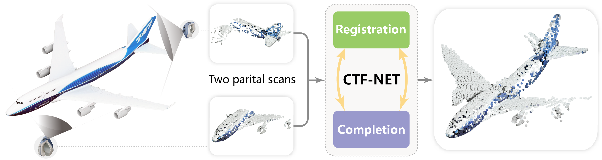
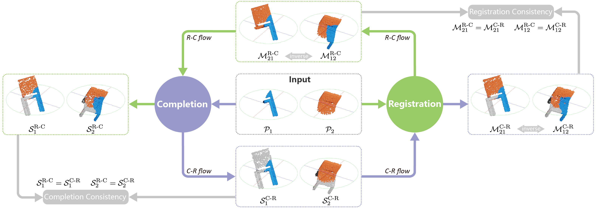

# CTF-Net
[TVCG 2021] Consistent Two-Flow Network for Tele-Registration of Point Clouds




### Introduction

Rigid registration of partial observations is a fundamental problem in various applied fields. In computer graphics, special attention has been given to the registration between two partial point clouds generated by scanning devices. State-of-the-art registration techniques still struggle when the overlap region between the two point clouds is small, and completely fail if there is no overlap between the scan pairs. In this paper, we present a learning-based technique that alleviates this problem, and allows registration between point clouds, presented in arbitrary poses, and having little or even no overlap, a setting that has been referred to as *tele-registration*. Our technique is based on a novel neural network design that learns a prior of a class of shapes and can complete a partial shape. The key idea is combining the registration and completion tasks in a way that reinforces each other. In particular, we simultaneously train the registration network and completion network  using two coupled flows, one that *register-and-complete*, and one that *complete-and-register*, and encourage the two flows to produce a consistent result.

For more details, please refer to our [project page](https://vcc.tech/research/2021/CTFNet).



### Usage

To be added.

### Dataset

To be added.

### License
Our code is released under MIT License. See LICENSE file for details.

### Citation

Please cite the paper in your publications if it helps your research:
```
@article{CTFNet21,
title={Consistent Two-Flow Network for Tele-Registration of Point Clouds},
author={Zihao Yan and Zimu Yi and Ruizhen Hu and Niloy J. Mitra and Daniel Cohen-Or and Hui Huang},
journal={IEEE Transactions on Visualization and Computer Graphics},
volume={},
pages={},
year={2021},
}

```
